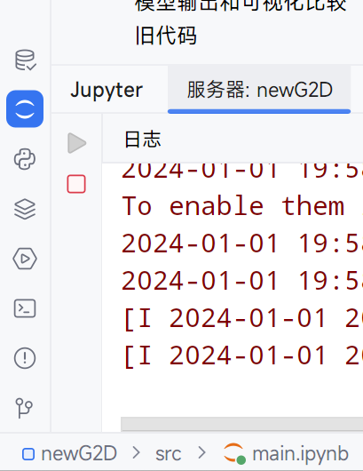
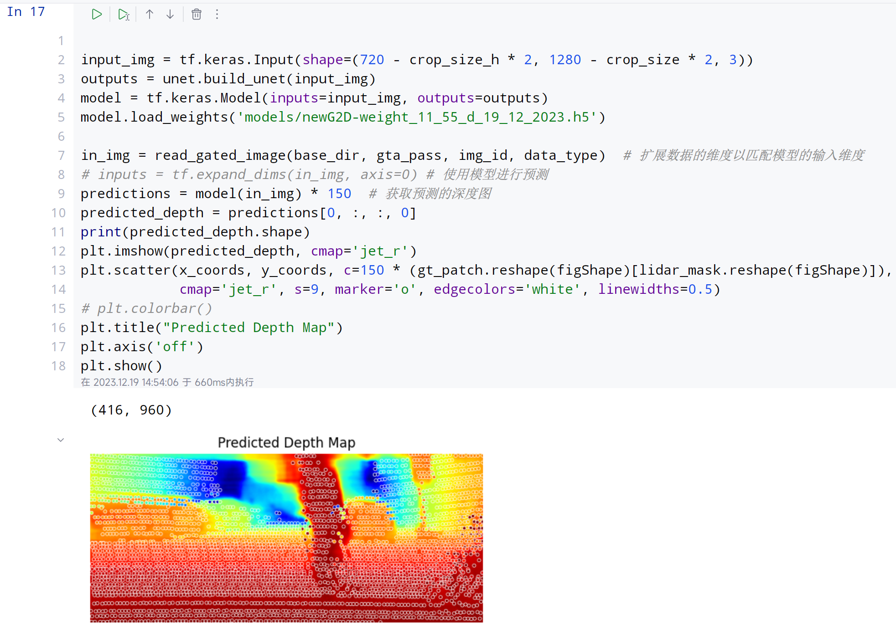
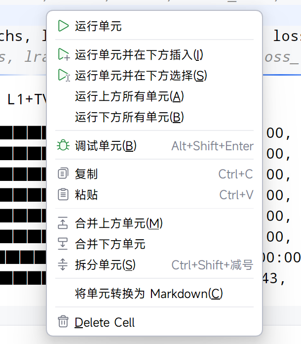
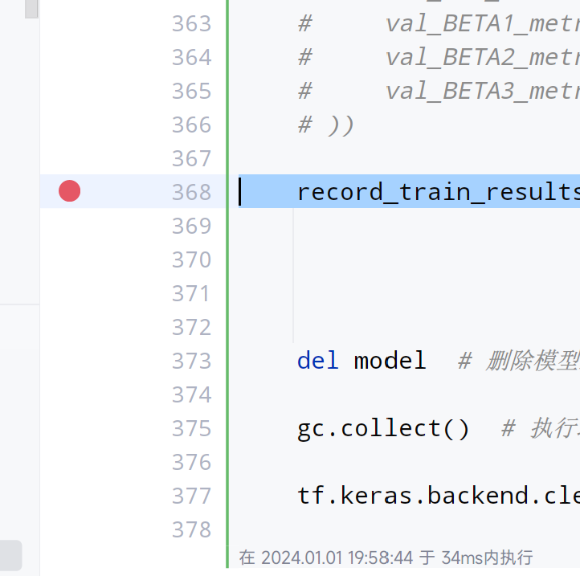
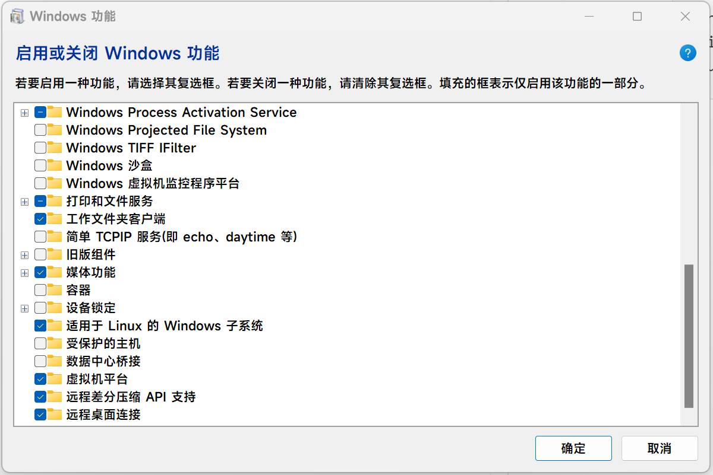
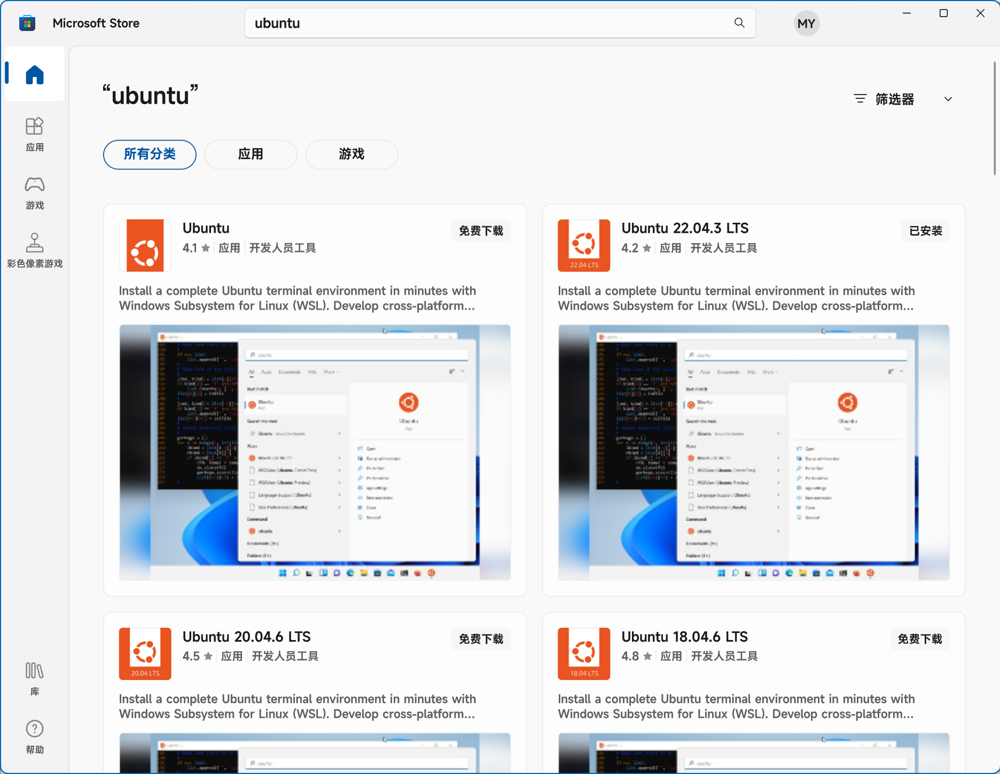
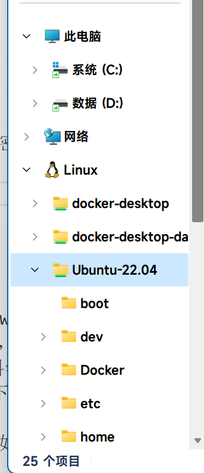
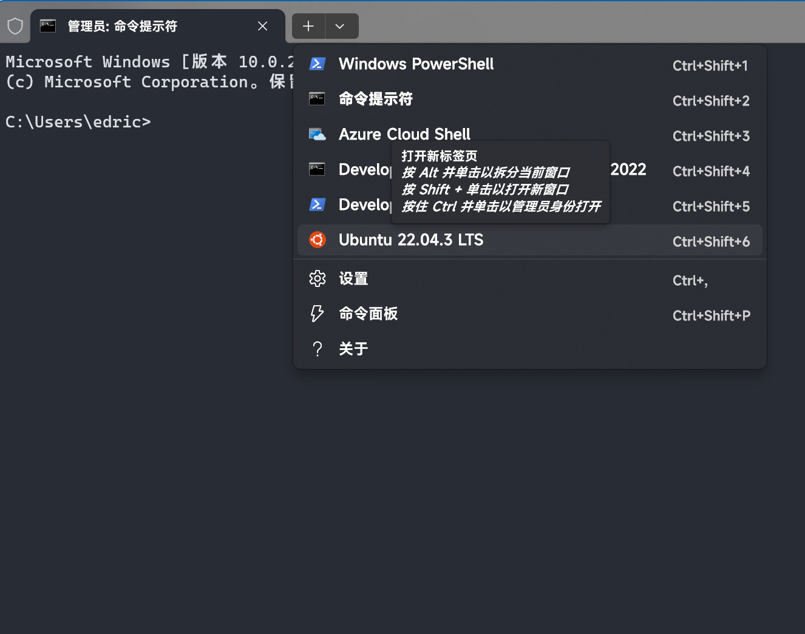
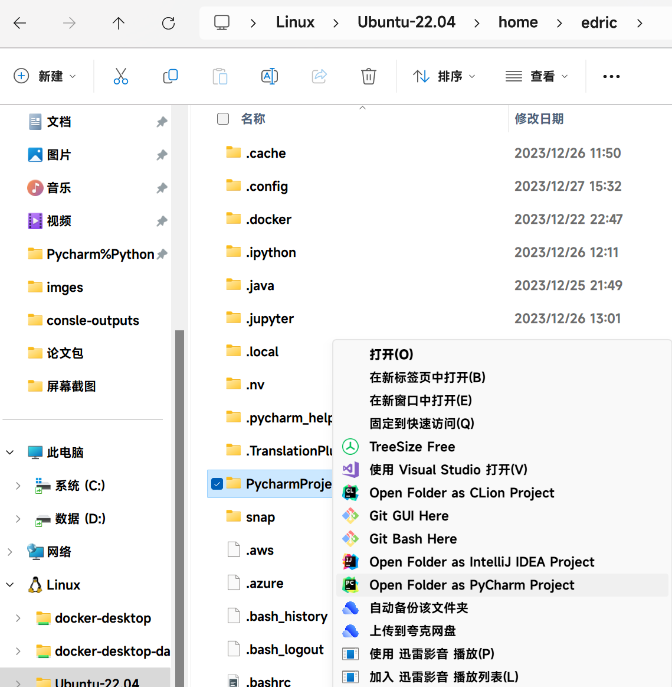

## Pycharm%Python好用的工具分享

###### Created by Edricc2 on 2024.1.1

分为以下几节：

[1. Juptyer Notebook](#JuptyerNotebook)

[2. 进度条`tqdm`](#进度条`tqdm`)

[3. 直接对WSL2（Windows的Linux子系统）进行远程开发](#直接对WSL2（Windows的Linux子系统）进行远程开发)

### I. Juptyer Notebook
pycharm专业版可以轻松的使用jupyter，在配置好python环境以后，只需要新建Juptyer Notebook文件即可。之后，pycharm会提示你安装jupyter模块，安装即可。

- **开启运行时/运行代码**：点击对应代码块运行即可
- **停止运行时**：pycharm左下角如图，这个窗口中也会显示日志。
    - 关闭内核意味着放弃当前内存运行时的所有变量，关闭之前尽量将需要的变量输出文件（比如训练好的模型和评测的指标结果）
    - 在遇到大量修改代码、内存/显存溢出、模型占据资源难以释放等情况时，重启内核是个好办法。

- 


**在Juptyer Notebook中，可以以插入代码块和markdown块，先说代码块：**

1. **执行顺序**：Juptyer启动后会创建一个持久的python运行时，这些代码块相互之间的执行顺序、变量赋值等操作，不是按照他们的空间排列顺序，而是取决于你执行它们的时间顺序。如果你在多次执行不同位置的代码导致变量数据混乱时，建议重启内核。
2. **输出**：在执行当前代码块代码时，所有的输出都将会在当前代码块下面输出，即使调用了在其他代码块的函数
3. **图片输出**：在使用`import matplotlib.pyplot as plt`绘制图表/图片时，在绘制好图形以后，使用`plt.show()`即可直接输出图片到该单元格下面。



4. 对所有单元格的输出，只要不被刷新和手动清除，即使关闭内核以后，都会一直存在。
5. 单元格右键菜单提供常用的功能



6. **断点调试**：可与python普通模式一样，可在jupyter中设置断点进行调试，设置完断点以后，在右键选择调试单元即可。即使断点在其他单元格也可以。



---
---
---------------------------

### II. 进度条`tqdm`


python的进度条库tqdm效果如下，使用pip直接安装

```
Epoch 0: 100%|██████████| 4014/4014 [10:00<00:00,  6.68it/s, MAE=9.1303, RMSE=15.0383] 
Epoch 1: 100%|██████████| 4014/4014 [09:59<00:00,  6.70it/s, MAE=7.4569, RMSE=12.8997]
Epoch 2: 100%|██████████| 4014/4014 [10:15<00:00,  6.53it/s, MAE=6.6767, RMSE=11.8849]
Epoch 3: 100%|██████████| 4014/4014 [10:00<00:00,  6.68it/s, MAE=10.6142, RMSE=17.5672]
Validation : 100%|██████████| 446/446 [00:44<00:00, 10.11it/s]
```

- 简单方法
    
    将
    ```
    for i in range(10000):
    ```
    改为
    ```
    from tqdm import tqdm

    for i in tqdm(range(10000)):
    ```
    
- 更高度自定义
    
    在batch循环前加入如下，使用变量pbar更新详细信息
    ```
    with tqdm(total=len(sample_ids), desc='Epoch ' + str(epoch)) as pbar:
        for id in sample_ids:

            ...
            ...

            train_mae_metric(batch_mae)
            train_rmse_metric(batch_rmse)
            losses(loss)

            pbar.set_postfix(Loss="{:.4f}".format(losses.result()),
                                MAE="{:.2f}".format(train_mae_metric.result() * 150),
                                RMSE="{:.4f}".format(train_rmse_metric.result()))
            pbar.update(1)

            ...
            ...

    ```


完整使用方法参考官网[tqdm documentation](https://tqdm.github.io/)


----
---
---


### III. 直接对WSL2（Windows的Linux子系统）进行远程开发

1. **开启WSL2**

    - 最新的Windows11中，在开始中搜索并打开`启用或关闭 Windows 功能`，勾选`适用于Linux的Windows子系统`、`虚拟机平台`（可能需要Windows11专业版），点确定后重启电脑。
    


    - 在Microsoft Store中搜索你想要的Linux系统，我使用的是Ubuntu，选择了`Ubuntu 22.04.3 LTS`，一键安装
    


    - 安装完直接打开，设置用户名和密码就可以使用了

    - 可以直接在Windows的文件管理器访问子系统文件
    


2. **WSL的一些配置**

    - **镜像网络**：在最新的Windows11中，可以开启wsl的镜像网络功能，该功能可以使子系统和主系统共享同样的网络环境，不必再多一层虚拟路由。 对我们的好处是，在这个模式下，当Windows开启了网络代理(科学上网)软件，子系统可以自动连接代理，会大大提高apt和pip等工具的访问速度。方法如下：

        在Windows当前用户目录下（如`C:\Users\edric\`）创建`.wslconfig`文件。写入并保存：
        ```
        [experimental]
        networkingMode=mirrored
        dnsTunneling=true
        firewall=true
        autoProxy=true
        ```
        还可以配置一些其他的，例如最大内存和逻辑核数量：
        ```
        # Settings apply across all Linux distros running on WSL 2
        [wsl2]

        # Limits VM memory to use no more than 4 GB, this can be set as whole numbers using GB or MB
        memory=7GB 
        # Sets the VM to use two virtual processors
        processors=8

        [experimental]
        networkingMode=mirrored
        dnsTunneling=true
        firewall=true
        autoProxy=true
        ```
        保存文件之后，在cmd中关闭wsl，等待至少半分钟后再启动wsl，或者直接重启电脑
        ```
        wsl --shutdown
        ```
        在Windows11最新版中自带的终端（Windows Terminal）中，可以直接打开子系统终端。在`Ubuntu 22.04.3 LTS`中使用`htop`命令可以实时监控子系统资源。
        


    - 关于在Ubuntu 22.04.3 LTS下配置cuda环境，可以大致参考另一篇[wsl2的ubuntu22.04子系统下，搭建cuda深度学习环境](https://github.com/Edricos/UnetWithVIT/blob/master/Readme.md)


3. Pycharm直接远程开发WSL2

在子系统中配置好需要的python环境，并且将代码复制/git到子系统以后，可以之间在文件管理中用pycharm打开项目



打开以后选择子系统内的python解释器即可（ubuntu中`whereis python3.9`命令查看python位置）


